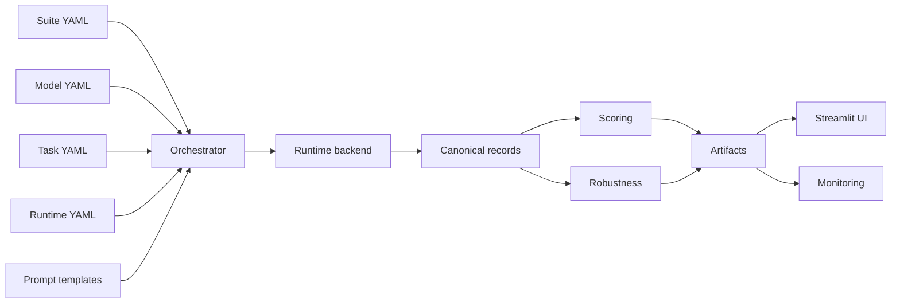

# Concepts

The Concepts section explains the vocabulary that the rest of the
documentation relies on: what a task is, what a track is, what a
runtime does, and how scoring and robustness fit together.

Read these pages in order if you are new to the package. They are
deliberately short and each one maps to one module in the source
tree, so you can jump to code any time.

| Page                                                   | Source                                      |
|--------------------------------------------------------|---------------------------------------------|
| [Datasets and tasks](datasets-and-tasks.md)            | `src/parhaf_clinbench/tasks/`               |
| [Tracks and prompts](tracks-and-prompts.md)            | `src/parhaf_clinbench/prompting/`           |
| [Runtimes](runtimes.md)                                | `src/parhaf_clinbench/runtimes/`            |
| [Scoring and bootstrap](scoring.md)                    | `src/parhaf_clinbench/scoring/`             |
| [Robustness metrics](robustness.md)                    | `src/parhaf_clinbench/reporting/analysis/`  |

## The moving parts in one picture

A suite is the top-level unit of a campaign. It references tasks,
models, tracks, and a runtime. The orchestrator resolves every
reference, asks the runtime to produce canonical records for each
document, scores those records against the gold, and writes the
artifacts that the UI and the monitoring dashboard read.
