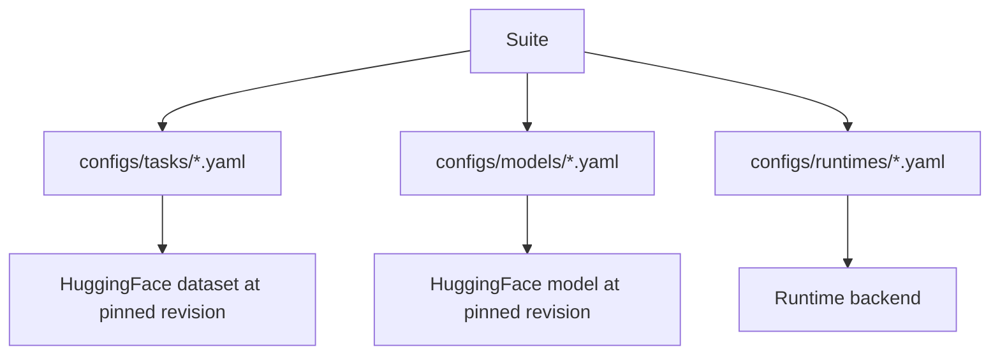

# Configuring a suite

A **suite** is the single entry point of a benchmark campaign. It
selects which models, tasks, tracks, and runtime the orchestrator
will use, and it fixes the inference parameters.

Source loader:
[`parhaf_clinbench.orchestration.experiment_plan`](../reference/parhaf_clinbench/orchestration/experiment_plan.md).

## Anatomy of a suite

```yaml title="configs/suites/v1_full.yaml"
suite_id: v1_full
benchmark_version: v1
tracks: [zero-shot, few-shot]
tasks: [pseudo, infectio, response, scenario]
models:
  - qwen25_7b
  - gemma2_9b
  - ministral_8b
  - aya_8b
  - llama31_8b
  - lucie_7b
  - gliner2_multi
runtime_overrides:
  gliner2_multi: gliner
runtime_default: vllm
parameters:
  temperature: 0.0
  top_p: 1.0
  max_tokens: 512
  seed: 42
```

Every field has a single responsibility.

| Field                | Role                                                                              |
|----------------------|-----------------------------------------------------------------------------------|
| `suite_id`           | Human-readable name. Appears in run IDs and in the UI.                           |
| `benchmark_version`  | Schema version of the benchmark. Change only alongside breaking schema changes.  |
| `tracks`             | Which prompting regimes to evaluate. Values: `zero-shot`, `few-shot`.            |
| `tasks`              | Which tasks to run. Values: `pseudo`, `infectio`, `response`, `scenario`.        |
| `models`             | List of model IDs. Each ID must match a YAML file under `configs/models/`.       |
| `runtime_default`    | Runtime applied to any model without an override.                                 |
| `runtime_overrides`  | Map of `model_id` to runtime when it differs from the default.                    |
| `parameters`         | Inference parameters applied uniformly across cells.                              |

## Reference resolution



The orchestrator resolves every reference at campaign start and
fails fast on any missing file, unknown model, or unknown runtime.
No silent defaults.

## Writing a new suite

1. Copy `configs/suites/v1_full.yaml` to `configs/suites/<your_name>.yaml`.
2. Trim the model list and the track list to the scope you want.
3. If you need a new model, see [Adding a new model](adding-a-model.md).
4. Validate the suite by running the smoke command against it:

    ```bash
    uv run parhaf-clinbench smoke --suite configs/suites/<your_name>.yaml --output-dir results/smoke
    ```

5. Launch the full campaign:

    ```bash
    uv run parhaf-clinbench run --suite configs/suites/<your_name>.yaml --output-dir results/<your_name>
    ```

## Parameters field reference

| Parameter      | Meaning                                                     | Typical value for greedy decoding |
|----------------|-------------------------------------------------------------|-----------------------------------|
| `temperature`  | Sampling temperature passed to vLLM.                        | `0.0`                             |
| `top_p`        | Nucleus sampling threshold. Ignored when temperature is 0.  | `1.0`                             |
| `max_tokens`   | Maximum response length in generated tokens.                | `512`                             |
| `seed`         | Sampler seed passed to vLLM.                                | `42`                              |

The default suites in the repository use greedy decoding. Sampling
is supported but is the responsibility of the suite author: none of
the built-in reproducibility guarantees hold when `temperature > 0`.
