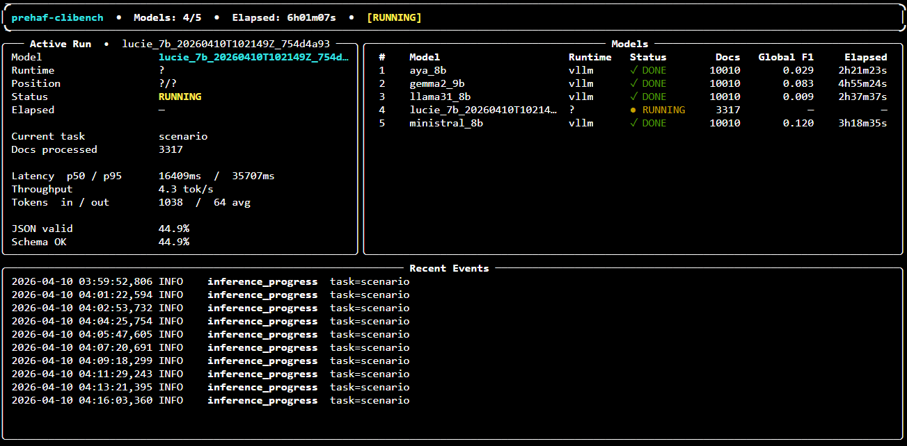

# Monitoring dashboard

The monitoring dashboard is a terminal UI built with
[Rich](https://rich.readthedocs.io/). It reads the same JSON event
stream that the orchestrator writes, so it can attach to a live run
or replay a finished one.



Source: [`monitoring/dashboard.py`](https://github.com/lounesmechouek/parhaf-clinbench/tree/main/monitoring).

## Launching

```bash
uv run python -m monitoring.dashboard --run-dir results/<run_id>
```

The process polls the run directory in place and refreshes the
display. It never holds a lock on the run, so it is safe to attach
and detach as many instances as you want.

## What the panes show

| Pane            | Content                                                                     |
|-----------------|-----------------------------------------------------------------------------|
| Header          | Run ID, suite, progress fraction, elapsed time, global status.              |
| Active cell     | Currently executing `(model, task, track)`, with elapsed time in the cell. |
| Latency         | Median and p95 latency for the active cell.                                 |
| Throughput      | Documents per second, rolling average.                                      |
| Output validity | Share of parsed JSON responses since the cell started.                      |
| Models          | Table of every model in the suite with status and elapsed time.             |
| Event stream    | Latest task-level events: cell start, cell completion, schema failures.     |

## When to use it

- During a long campaign, to catch hangs or a collapsed-conformity
  run before it wastes GPU hours.
- During model onboarding, to confirm the first few documents
  produce the expected schema before letting the whole suite run.
- As a replay tool, by pointing it at a finished run to walk back
  through the event stream.

## Relationship to the Streamlit UI

The two tools serve different audiences. The monitoring dashboard
is for the operator who wants to know what is happening right now
and needs a terminal. The Streamlit UI is for the analyst who wants
to read a finished run.

They share nothing but the artifact format. If you do not need one
of them, you do not need to install it.
