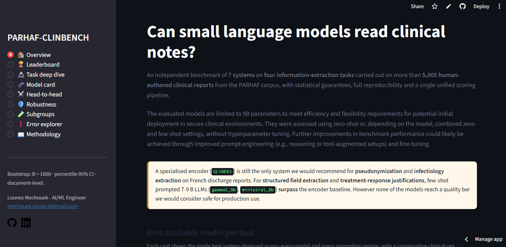

---
hide:
  - navigation
---

# parhaf-clinbench

**A reproducible benchmark for clinical information extraction with language models on PARHAF.**

`parhaf-clinbench` is a Python package that turns a set of YAML files into a
complete evaluation campaign over the four PARHAF clinical information
extraction tasks. It runs any vLLM-compatible HuggingFace model, or a
GLiNER2 encoder baseline, under deterministic settings with structured
output decoding, computes micro-F1 with document-level bootstrap
confidence intervals, and writes a reproducible set of artifacts that
feed a Streamlit UI and a terminal monitoring dashboard.

The package and the results of the study v1 are distinct artifacts.
The package is a general runner for PARHAF. The study is one instance
of what it produces, described in detail on the companion
[blog post](https://lounesmechouek.com/writing/slm_benchmark/).

{ .hero }

## What it does

### Four PARHAF tasks
Pseudonymization, infectiology, response to treatment, and structured
scenario, each wired end to end with its canonical schema and its
official micro-F1 metric.

### Any vLLM-compatible LLM
Add a new model by writing a single YAML file under `configs/models/`
with its HuggingFace identifier and a pinned revision. The vLLM
runtime handles serving and xgrammar-backed structured output.

### GLiNER2 encoder baseline
An encoder-based runtime is included out of the box, exposed through
the same `RuntimeBackend` interface as the LLM runtimes, for
side-by-side comparisons.

### Bootstrap uncertainty
Every scored cell ships with a 95% document-level bootstrap
confidence interval. Paired bootstrap utilities quantify head-to-head
deltas between models.

### Reproducibility by default
Pinned HuggingFace revisions, SHA-256 prompt hashes, seeded bootstrap,
a full run manifest, and a scoring audit that reproduces shipped
numbers to six decimal places.

### Operator tooling
A Streamlit UI explores completed runs. A Rich-based terminal
dashboard monitors live campaigns. A Docker image is published on
DockerHub for pod-style GPU clouds.

## Where to start

- New to the project: read [Installation](getting-started/installation.md)
  and [Quickstart](getting-started/quickstart.md).
- Understanding the design: start with [Concepts](concepts/index.md).
- Running your own benchmark: see the [User guide](guide/index.md).
- Operating in production: see [LLMOps](llmops/index.md).
- Extending the code: browse the [API reference](reference/parhaf_clinbench/index.md).

## Citing this work

A BibTeX entry is available on the [License page](about/license.md).
The published study uses this codebase at a specific revision and is
cited separately on its own [page](studies/index.md).
