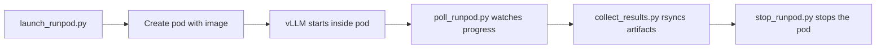

# RunPod and GPU pods

The recommended cloud target for a full campaign is
[RunPod](https://www.runpod.io/). The ops helpers under
`src/parhaf_clinbench/ops/` and `infra/runpod/` automate the pod
lifecycle end to end. Any other GPU cloud that can run the Docker
image works too; the RunPod path is simply the one the codebase
drives directly.

## The flow



Each step is a Python module and can be invoked independently.

| Step             | Module                                      | Purpose                                               |
|------------------|---------------------------------------------|-------------------------------------------------------|
| Launch           | `parhaf_clinbench.ops.launch_runpod`        | Create a pod with the benchmark image and suite env.  |
| Poll             | `parhaf_clinbench.ops.poll_runpod`          | Watch pod logs and run progress.                      |
| Collect results  | `parhaf_clinbench.ops.collect_results`      | Rsync the run directory back to the workstation.      |
| Stop             | `parhaf_clinbench.ops.stop_runpod`          | Stop or terminate the pod cleanly.                    |

Lower-level RunPod API wrappers live in
`parhaf_clinbench.ops.runpod_client`.

Complementary reference scripts are in `infra/runpod/`:
`launch_pod.py`, `wait_pod.py`, `fetch_results.py`,
`stop_or_terminate.py`, plus example pod specifications under
`pod_spec_examples/`.

## Required environment

The ops helpers read their credentials from the environment:

| Variable                | Role                                                 |
|-------------------------|------------------------------------------------------|
| `RUNPOD_API_KEY`        | Authentication for the RunPod REST API.              |
| `HF_TOKEN`              | HuggingFace token, forwarded to the pod environment. |
| `DOCKER_IMAGE_REF`      | Full image reference to pull on the pod.             |
| `BENCHMARK_SUITE`       | Suite path inside the image, for example `configs/suites/v1_full.yaml`. |
| `BENCHMARK_OUTPUT`      | Output directory inside the pod.                     |

The helpers fail fast if any required variable is missing.

## Pod specification

Example pod specs under `infra/runpod/pod_spec_examples/` document
the shapes the codebase expects:

- GPU: single RTX A6000 or equivalent with 24 GB or more.
- Disk: 200 GB for a full model cache.
- Network volume: optional, convenient for warm caches across pods.
- Exposed ports: 8000 (vLLM HTTP) and 22 (SSH for rsync).

## A complete flow

```bash
export RUNPOD_API_KEY="..."
export HF_TOKEN="hf_..."
export DOCKER_IMAGE_REF="<registry>/parhaf-clinbench-vllm:sha-<short>"
export BENCHMARK_SUITE="configs/suites/v1_full.yaml"
export BENCHMARK_OUTPUT="/workspace/results/v1_full"

uv run python -m parhaf_clinbench.ops.launch_runpod \
  --name parhaf-v1-full \
  --gpu "NVIDIA RTX A6000" \
  --image "$DOCKER_IMAGE_REF"

uv run python -m parhaf_clinbench.ops.poll_runpod --name parhaf-v1-full

uv run python -m parhaf_clinbench.ops.collect_results \
  --name parhaf-v1-full \
  --remote "$BENCHMARK_OUTPUT" \
  --local "results/v1_full"

uv run python -m parhaf_clinbench.ops.stop_runpod --name parhaf-v1-full
```

The pod entrypoint `run_vllm_then_benchmark.sh` handles the in-pod
orchestration: it starts vLLM, waits for the healthcheck, runs
`parhaf-clinbench run`, then exports the results.

## Other GPU clouds

The Docker image is the portable unit. Any service that can run a
Linux container with a CUDA 12 runtime and a single GPU can host
the benchmark. The RunPod-specific helpers will not work elsewhere,
but the image and the suite YAML will.
